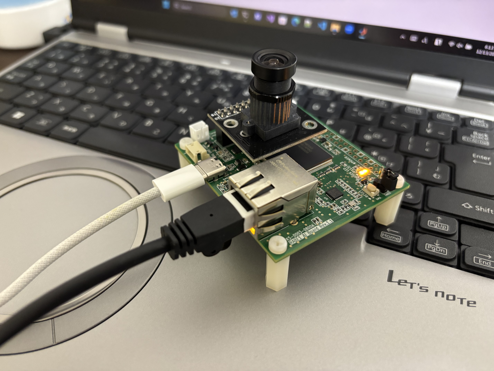
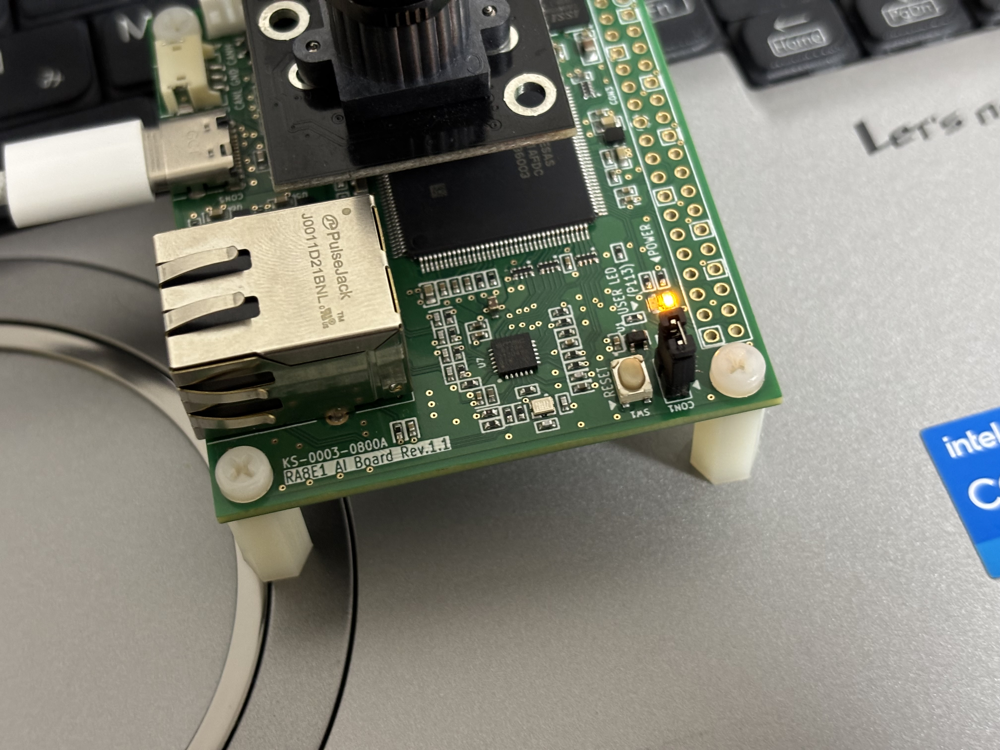
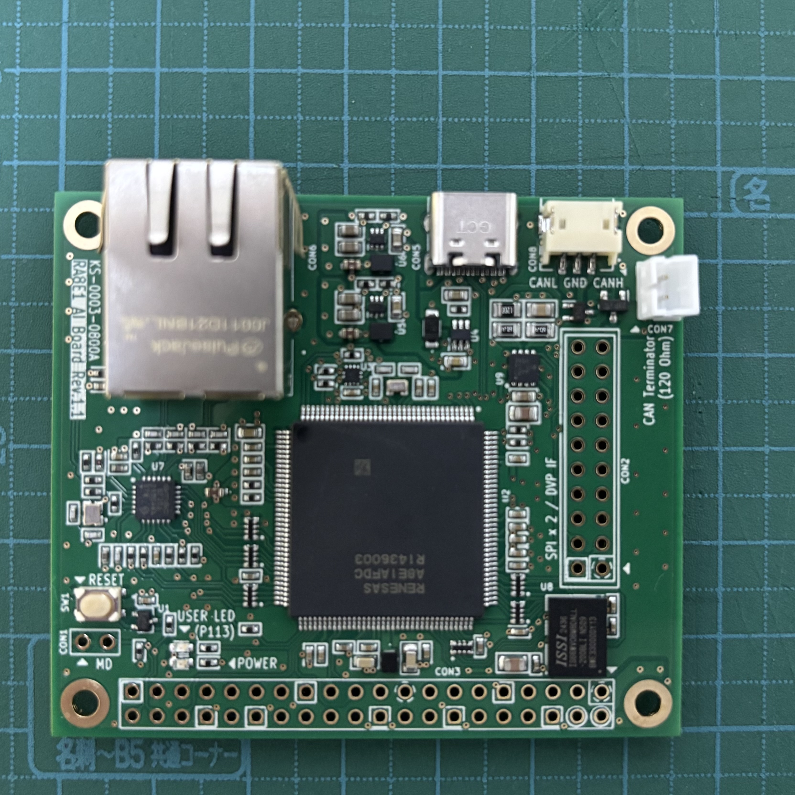
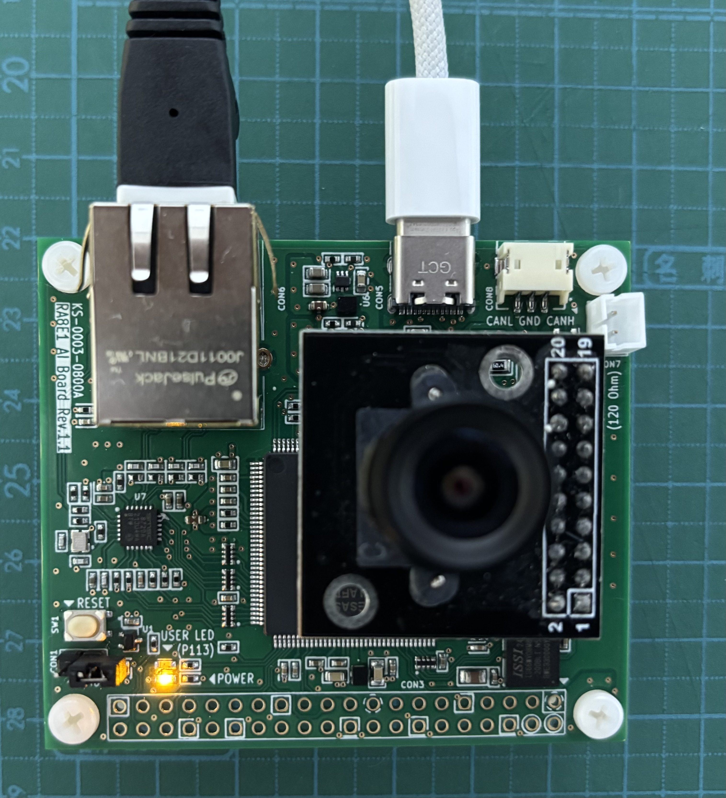

# RA8E1 Real-time Image Transmission System

RA8E1マイコンを使用したリアルタイム画像伝送システム．カメラからキャプチャした画像をOctalRAMに保存し，UDP通信でMATLABに送信してリアルタイム表示するプロジェクト．

<p align="center">
  
  <br>
  <em>RA8E1開発基板 - OV5642カメラモジュール，LAN8720A Ethernet PHY，IS66WVO8M8DALL OctalRAM搭載</em>
</p>

## システム概要

- **マイコン**: Renesas RA8E1 (R7FA8AFDCFB)
- **カメラ**: OV5642 (YUV422形式，QVGA 320×240)
- **メモリ**: OctalRAM IS66WVO8M8DALL (8MB)
- **通信**: Ethernet UDP (ポート9000)
- **機能**: リアルタイム動画ストリーミング (約1-2 fps)

## 開発環境のセットアップ

このプロジェクトは**Visual Studio Code + Renesas Extension**を使用した開発を推奨しています。

### 必要なコンパイラ

**LLVM Embedded Toolchain for Arm**
- **推奨バージョン**: v18.1.3（Renesas指定バージョン）
- **ダウンロード**: [LLVM Embedded Toolchain for Arm](https://github.com/ARM-software/LLVM-embedded-toolchain-for-Arm/releases)
- **インストール例**: 
  - Windows: `C:/LLVM-ET-Arm-18.1.3-Windows-x86_64/`
  - Linux: `/home/user/LLVM-ET-Arm-18.1.3-Linux-AArch64/`

#### PATH指定方法

**方法1: cmake/llvm.cmake を直接編集（推奨）**
```cmake
# cmake/llvm.cmake の3行目を編集
set(ARM_TOOLCHAIN_PATH "C:/LLVM-ET-Arm-18.1.3-Windows-x86_64/bin")
# または
# set(ARM_TOOLCHAIN_PATH "/home/user/LLVM-ET-Arm-18.1.3-Linux-AArch64/bin")
```

**方法2: CMakeコマンドラインで指定**
```bash
cmake -DARM_TOOLCHAIN_PATH="C:/LLVM-ET-Arm-18.1.3-Windows-x86_64/bin" ...
```

**セットアップ方法は下記のRenesas公式動画を参照してください**:
- [Visual Studio Code - How to Install Renesas Extensions](https://www.bing.com/videos/riverview/relatedvideo?q=renesas+fsp+vsCode&mid=2458A3064E6E4F935C8E2458A3064E6E4F935C8E&FORM=VIRE)

## ビルド方法

### Visual Studio Codeでのビルド
- Set ARM_LLVM_TOOLCHAIN_PATH as an environment variable before starting VS code or alternatively set ARM_TOOLCHAIN_PATH in .vscode/cmake-kits.json
- Select "ARM LLVM kit with toolchainFile" kit in VS Code status bar
- Click build in VS Code status bar
- It is recommended to avoid spaces in the toolchain and project paths as they might be interpreted as delimiters by CMake and the other build tools.

Example:
```powershell
set ARM_LLVM_TOOLCHAIN_PATH=C:/LLVMEmbeddedToolchainForArm-18.1.3-Windows-x86_64/bin
cd "c:/Users/lynxe/Documents/GitHub/RA8E1_prj"
code .
```

### CLI でのビルド
Configure:
```bash
cmake -DARM_TOOLCHAIN_PATH="C:/LLVMEmbeddedToolchainForArm-18.1.3-Windows-x86_64/bin" -DCMAKE_TOOLCHAIN_FILE=cmake/llvm.cmake -G Ninja -B build/Debug
```

Build:
```bash
cmake --build build/Debug
```

## マイコンへの書き込み方法

<p align="center">
  
  <br>
  <em>ブートモード設定 - CON1ショートとSW1ボタン位置</em>
</p>

### ブートモードへの移行
1. **CON1をショート**: ショートプラグでCON1の2ピンを短絡(※シルク印刷は写真では上下反転)
2. **SW1を押す**: リセットボタン(SW1)を押してブートモードに入る
3. **書き込み準備完了**: RA8マイコンが書き込み待機状態になる

### Renesas Flash Programmerでの書き込み
1. [Renesas Flash Programmer](https://www.renesas.com/ja/software-tool/renesas-flash-programmer-programming-gui)をダウンロード・インストール
2. ビルドで生成されたHEXファイルを指定:
   - デバッグビルド: `build/Debug/RA8E1_prj.hex`
   - リリースビルド: `build/Release/RA8E1_prj.hex`
3. 接続設定:
   - **インターフェース**: USB CDC
   - **デバイス**: RA8E1 (R7FA8AFDCFB)
4. 書き込み実行後，**CON1のショートを外してからSW1を押す**(通常起動)

## 使用方法

### MATLAB受信側
```matlab
% UDP受信開始(無制限受信モード)
udp_photo_receiver

% リアルタイムで動画ストリーミング表示
% 停止: Ctrl+C または画像ウィンドウを閉じる
```

### 通信プロトコル
- **動作モード**: マルチフレーム動画送信
- **チャンク送信間隔**: 0ms(最速，pbuf確保失敗時は1msリトライ)
- **フレーム間隔**: 2ms(設定可変)
- **フレーム数**: 無制限(total_frames = -1)または指定数
- **チャンクサイズ**: 512バイト/パケット
- **総パケット数**: 300パケット/フレーム
- **パケット構造**: 24バイトヘッダー + 512バイトデータ
- **実効フレームレート**: 約1-2 fps(ネットワーク環境依存)

## 設定のカスタマイズ

### C側設定(main_thread1_entry.c)
```c
ctx->interval_ms = 0;           // チャンク間隔 (0=最速, 推奨3-5ms)
ctx->frame_interval_ms = 2;     // フレーム間隔 (ms)
ctx->total_frames = -1;         // -1=無制限, 数値=指定フレーム数
```

### MATLAB側設定(udp_photo_receiver.m)
```matlab
total_timeout_sec = inf;        % inf=無制限, 数値=秒数制限
frame_timeout_sec = 10;         % フレームタイムアウト
```

## プロジェクト構造

```
RA8E1_prj/
├── src/                    # ソースコード
│   ├── hal_entry.c        # メインエントリーポイント
│   ├── main_thread*_entry.c # FreeRTOSタスク
│   ├── cam.c              # カメラ制御
│   ├── hyperram_integ.c   # OctalRAM統合
│   └── usb_cdc.h          # USB CDC通信
├── matlab/                # MATLAB受信コード
│   ├── udp_photo_receiver.m    # メイン受信関数
│   ├── test_udp_simple.m      # UDP接続テスト
│   └── viewQVGA_YUV.m         # YUV参照デコーダー
├── ra_gen/                # FSP生成ファイル
├── ra_cfg/                # FSPコンフィギュレーション
└── cmake/                 # CMake設定
```

## トラブルシューティング

### よくある問題
1. **UDP受信エラー**: MATLABのDSP System Toolbox確認
2. **画像表示なし**: ポート9000のファイアウォール設定確認
3. **色彩異常**: YUV422フォーマット・エンディアン設定確認
4. **pbuf allocエラー**: `interval_ms`を3-5msに増やす(lwIPメモリプール不足)
5. **フレームレート低下**: ネットワーク帯域，MATLAB処理速度を確認

---

## ハードウェア詳細

### 基板設定

#### Ethernet PHY (LAN8720A)
- **PHY IC**: LAN8720A
- **インターフェース**: RMII (Reduced Media Independent Interface)
- **動作確認**: DHCP自動IP取得，AutoIP対応

#### OctalRAM接続
- **IC**: IS66WVO8M8DALL
- **容量**: 64Mbit (8MB)
- **インターフェース**: Octal SPI
- **ベースアドレス**: `HYPERRAM_BASE_ADDR`
- **アドレス変換**: `((addr & 0xfffffff0) << 6) | (addr & 0x0f)`
- **アクセス制限**: 64バイト単位推奨

#### カメラインターフェース (CEU)
- **カメラモジュール**: OV5642
- **信号方式**: DVP (Digital Video Port)
- **データフォーマット**: YUV422 (YUYV)
- **制御インターフェース**: SCCB (I2C互換)
- **解像度**: QVGA (320×240)
- **フレームサイズ**: 153,600バイト (320×240×2)

#### USB通信
- **機能**: CDC (Communications Device Class)
- **用途**: デバッグログ出力 (`xprintf`)
- **ボーレート**: 自動 (USB CDC)

#### FreeRTOS構成
- **Thread0**: カメラキャプチャ → HyperRAM書き込み (200ms周期)
- **Thread1**: UDP動画ストリーミング送信
- **Thread2**: 予約(未使用)

### 基板組み立て手順

#### 1. 基板全体の確認

<p align="center">
  
  <br>
  <em>RA8E1開発基板全体 - 組み立て前の状態</em>
</p>

基板には以下のコネクタを実装します：
- **CON2**: DVPカメラ用2×10ピンソケット
- **CON1**: ブートモード切替用ピンヘッダ（ショートジャンパー用）
- **CON3**: Raspberry Pi互換スタッキングコネクタ（オプション）

> **Note**: CON3にRaspberry Pi用スタッキングコネクタ（2×20ピン）を実装することで、Raspberry Pi上にRA8E1基板をスタックして使用できます。写真では未実装ですが、必要に応じて半田付けしてください。

#### 2. カメラモジュールの取り付け

<p align="center">
  
  <br>
  <em>OV5642カメラモジュールをCON2にマウントした状態</em>
</p>

**組み立て手順**：
1. **CON2に2×10ピンソケットを半田付け** - DVPカメラインターフェース用
2. **CON1にピンヘッダを半田付け** - ショートジャンパー用（2ピン）
3. **OV5642モジュールをCON2に挿入** - カメラの向きに注意
4. **動作確認** - ショートやはんだブリッジがないか確認

## 技術仕様

### OctalRAM アドレス変換
Octal RAM特有のアドレスフォーマットに対応：
```c
uint32_t converted_addr = ((base_addr & 0xfffffff0) << 6) | (base_addr & 0x0f);
```

### YUV422 画像フォーマット
- **メモリレイアウト**: [V0 Y1 U0 Y0] (リトルエンディアン, 4バイト/2ピクセル)
- **色空間変換**: ITU-R BT.601標準
- **MATLAB デコード**: `dsp.UDPReceiver`使用

### パケット構造
```c
typedef struct {
    uint32_t magic_number;     // 0x12345678
    uint32_t total_size;       // 153600バイト
    uint32_t chunk_index;      // 0-299
    uint32_t total_chunks;     // 300
    uint32_t chunk_offset;     // オフセット
    uint16_t chunk_data_size;  // 512バイト
    uint16_t checksum;         // チェックサム
} udp_photo_header_t;        // 24バイト
```
